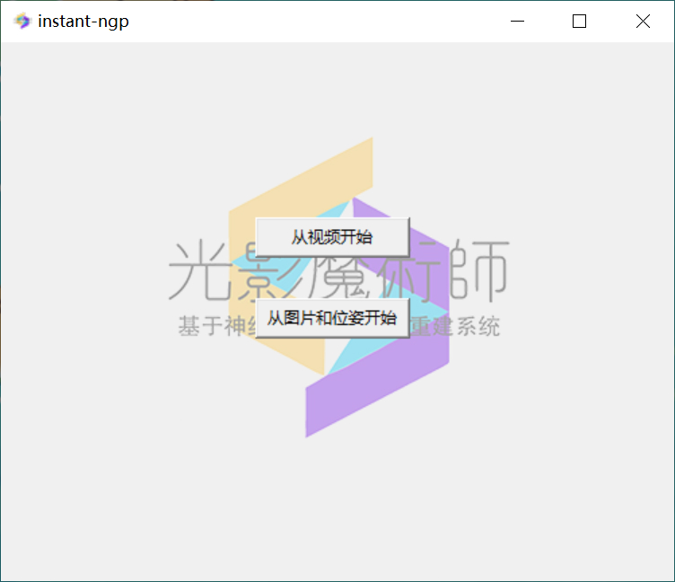
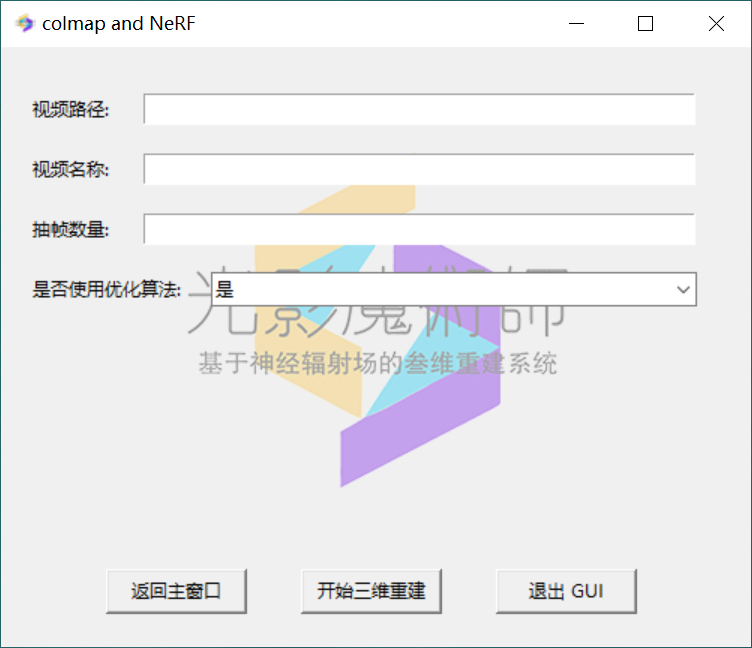
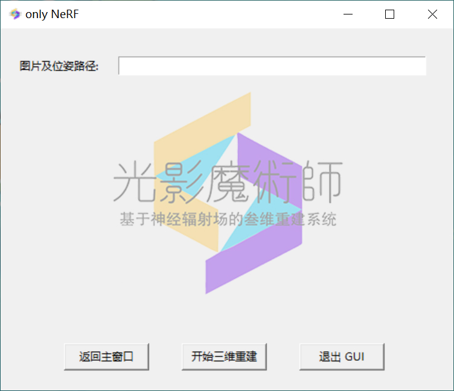
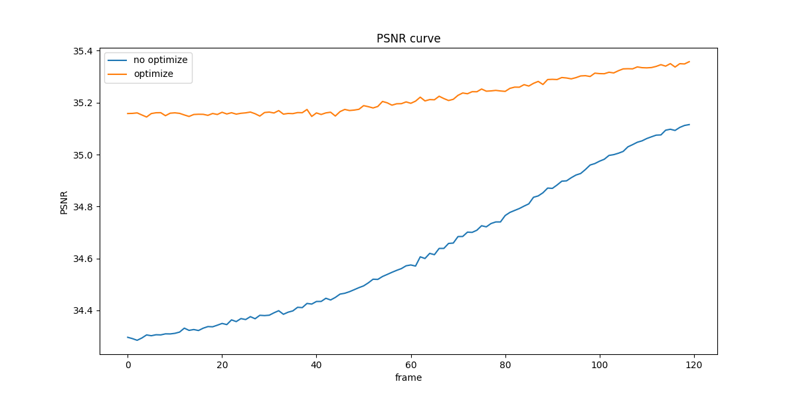
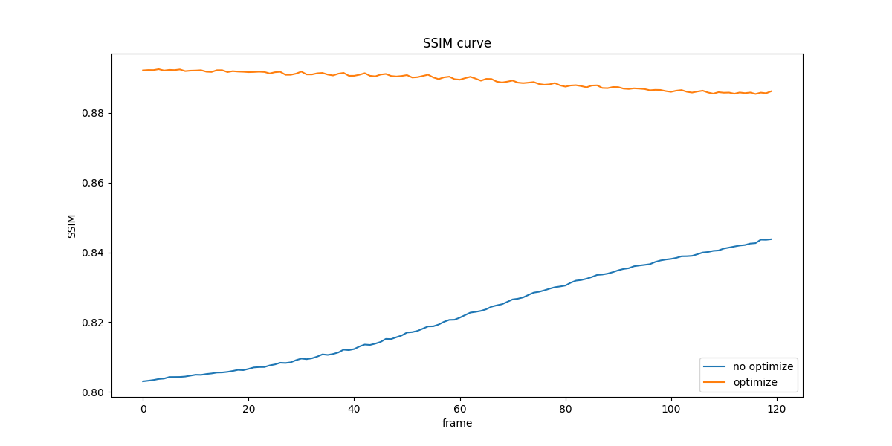
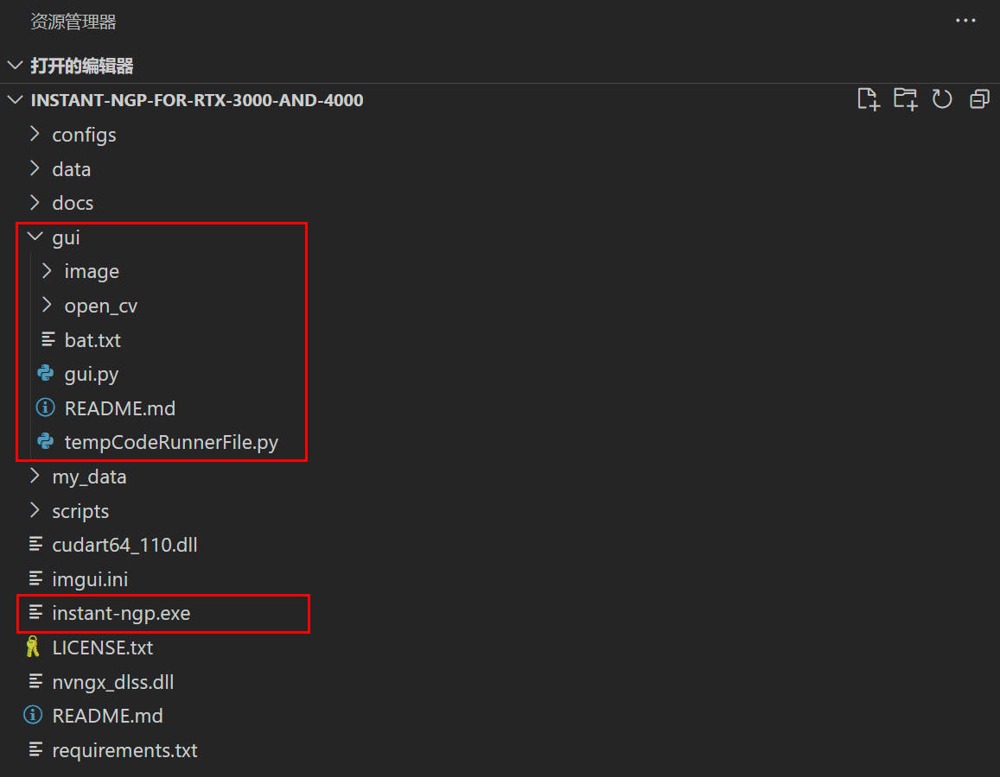
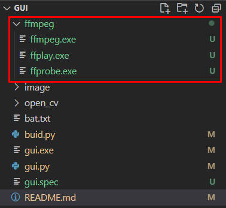

# 介绍
本代码为[instant-ngp](https://github.com/NVlabs/instant-ngp)的自编gui界面

## 界面展示

  
  
  

## 已实现的功能

1. 通过视频文件路径实现三维重建
2. 自定义视频抽帧帧数
3. 使用图像梯度算法优化视频抽帧，提高重建精度
4. 分级gui，首界面为`已有图片和位姿`和`从视频开始`，点击后跳转到不同的界面

## 待实现的功能

1. 添加`生成mesh文件`选项

## 优化效果
> `./videos`中展示了[优化前](./videos/video_no_optimize.mp4)和[优化后](./videos/video_with_optimize.mp4)的重建结果

使用图像梯度算法优化后的重建视频，有着更高的图像梯度（运动模糊更低），和更高的PSNR、SSIM值（与原视频更相似）

  
  
  

## instant-ngp附属功能

1. [如何保存重建视频](https://www.youtube.com/watch?v=3TWxO1PftMc)

# 使用

## 使用.py

1. 如果你使用RTX30系或RTX40系显卡，在[此处](https://github.com/NVlabs/instant-ngp/releases/download/continuous/Instant-NGP-for-RTX-3000-and-4000.zip)下载instant-ngp的release版本代码。如果你的下载速度较慢，也可以使用我分享的[百度云](https://pan.baidu.com/s/1XWwEZgd8lK6CahG1-_XoOA?pwd=dnid)链接进行下载(提取码：dnid)
2. 将本库克隆到`Instant-NGP-for-RTX-3000-and-4000\`下（与`instant-ngp.exe`同级） 
3. 在本库下创建文件夹`ffmpeg`，并下载`ffprobe.exe`放入`ffmpeg`文件夹下，可以使用[百度云](https://pan.baidu.com/s/1Mk8a08Fyg7YIvWFIGYdmAQ?pwd=um10)进行下载(提取码：um10) 
4. 安装`gui.py`必要的包后运行它，即可实现视频的三维重建

## 使用.exe

1. 运行`build.py`，并将生成的文件夹`dist`内的`gui.exe`移动至与`dist`同级目录下
2. 当然，你也可以直接使用源代码提供的`gui.exe`

# 注意

1. 当你第一次使用instant-ngp时，需要先下载`colmap`和`ffmpeg`，这可能会花费一些时间（运行时会自动下载，如果下载速度较慢，你可能需要试试“科学上网”😩）

